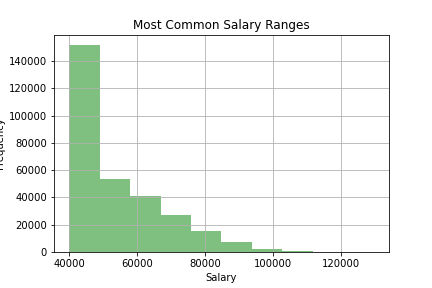
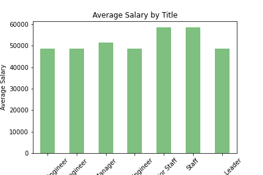

# SQL-Staff-Analysis

I performed data modeling, engineering, and analysis using 
files containing information about employees of a corporation from the 1980s and 1990s. 
I designed tables to hold data in the CSVs, imported the CSVs into a SQL database, and 
answered questions about the data. 

A note about importing data using my schema file, one of the tables has the columns reversed if using the file that is in my data folder- Dept_manager (I was keeping column order consistent in the ERD tables). Please switch the names in the column tab when importing in pgAdmin if you are using the same file to avoid an error.

Additionally, I created a couple of charts to visualize some of the data:

